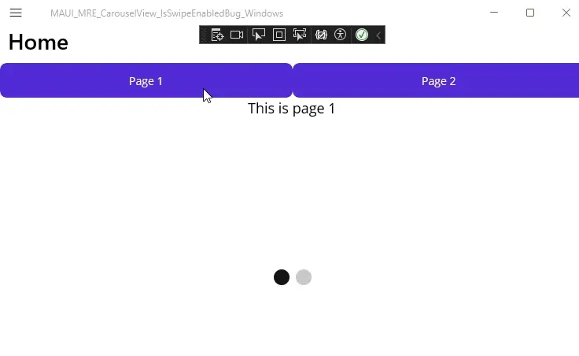

This repository serves as a Minimal Reproducible Example (MRE) for a reported bug in .NET MAUI's `CarouselView` where setting the `IsSwipeEnabled` property to `False` prevents visual navigation when the `Position` property is updated programmatically, specifically on the Windows platform.

This MRE is linked to GitHub Issue [#29216](https://github.com/dotnet/maui/issues/29216) where the problem is reported and discussed in detail.

## Problem Description

When the `CarouselView.IsSwipeEnabled` property is set to `False`, programmatically updating the `Position` property (e.g., through `TwoWay` binding from a ViewModel property or a `ScrollTo` method call) **does not** visually change the displayed view/item on the **Windows** platform. The CarouselView remains visually stuck on the initial page, even though the `Position` property's logical value and the `PositionChanged` event indicate the position has changed. On **Android**, setting `IsSwipeEnabled="False"` correctly disables swipe gestures while still allowing programmatic visual navigation.

## Steps to Reproduce

1.  Clone this repository to your local machine.
2.  Open the solution in Visual Studio.
3.  Build and run the project on the **Windows Machine (.NET 9)** target.
    *   *(Note: `IsSwipeEnabled` is set to `False` in MainPage.xaml)*
4.  Click the "Page 2" button.
5.  Observe the visual behavior of the `CarouselView` (it should remain visually stuck on Page 1, despite logs showing Position changed to 1) and check the output console for debug logs.
6.  Click the "Page 1" button.
7.  Observe the visual behavior again (it should remain visually stuck on the initial page, despite logs showing Position changed to 0).
8.  (Optional) Build and run the project on an **Android Emulator/Device (.NET 9)**. Observe that clicking the buttons correctly navigates the CarouselView visually, even though swiping is disabled.

## Expected Behavior

Setting `IsSwipeEnabled` to `False` should only disable user swipe gestures. Programmatically changing the `CarouselView`'s position should still cause the view to visually switch (either instantly or with animation, depending on the method used).

## Actual Behavior

On Windows, with `IsSwipeEnabled="False"`, updating `CarouselView.Position` via binding or command does not result in a visual change of the displayed item. The CarouselView remains visually static.

## Visual Evidence

**Windows Behavior GIF:**

**Android Behavior GIF:**

## Relevant Files

-   MainPage.xaml
-   MainPage.xaml.cs

## Environment

-   .NET Version: 9.0.100
-   .NET MAUI Version: 9.0.14
-   OS: Windows 10 22H2
-   IDE: Visual Studio 2022 17.13.6

---

**Related GitHub Issue:**

This MRE is the reproduction project for Issue [#29216](https://github.com/dotnet/maui/issues/29216) in the dotnet/maui repository. Please refer to that issue for detailed discussion, logs, and visual evidence (GIFs).

*(Note: This issue might be related to [#29215](https://github.com/dotnet/maui/issues/29215), which reports a distinct problem involving a `TwoWay` binding loop on the `Position` property with implicit or explicit `IsSwipeEnabled=True`.)*